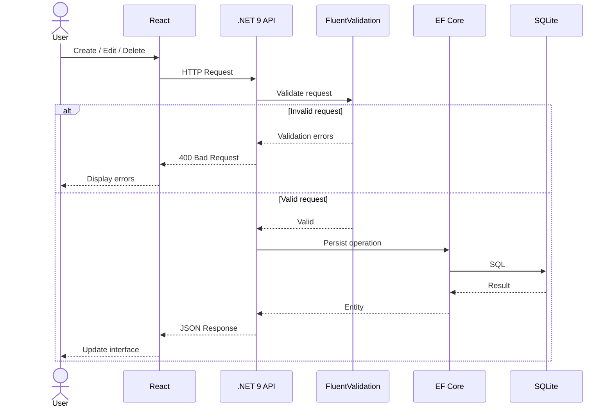

# 🎬 Gerenciador de Filmes e Séries

<p align="center">
  <strong>Aplicação Full Stack 100% funcional para gerenciamento de filmes e séries</strong>
</p>

<p align="center">
  
  
  
  
  
</p>

---

## 📌 Sobre o Projeto

O **Gerenciador de Filmes e Séries** é uma aplicação **Full Stack 100% funcional**, desenvolvida para demonstrar na prática conhecimentos em **desenvolvimento backend com .NET 9** e **frontend com React**.

A aplicação possui um **CRUD completo**, permitindo cadastrar, consultar, editar e excluir filmes e séries através de uma interface web desenvolvida em React.

O frontend se comunica com uma **API REST desenvolvida em .NET 9 Minimal API**, responsável pelas regras da aplicação, validação das requisições e persistência dos dados utilizando **Entity Framework Core e SQLite**.

### 💡 O projeto demonstra conhecimentos em:

* Desenvolvimento de APIs REST com **.NET 9**
* **Minimal API**
* Desenvolvimento de interfaces com **React**
* Integração **Frontend ↔ Backend**
* Operações completas de **CRUD**
* Entity Framework Core
* SQLite
* FluentValidation
* Modelagem de entidades
* Migrations
* Comunicação HTTP/JSON
* Organização de aplicações Full Stack

---

# 🚀 Funcionalidades

### 🎬 Filmes e Séries

* ✅ Cadastrar filmes
* ✅ Cadastrar séries
* ✅ Listar filmes e séries
* ✅ Visualizar detalhes
* ✅ Editar registros
* ✅ Excluir registros
* ✅ Persistir dados no banco
* ✅ Validar informações antes da persistência

### ⚛️ Frontend React

* ✅ Interface desenvolvida em React
* ✅ Componentização
* ✅ Formulários
* ✅ Integração com API REST
* ✅ Consumo de endpoints HTTP
* ✅ Atualização da interface após operações CRUD
* ✅ Feedback das operações realizadas

### 🚀 Backend .NET 9

* ✅ API REST
* ✅ Minimal API
* ✅ Entity Framework Core
* ✅ SQLite
* ✅ FluentValidation
* ✅ Migrations
* ✅ Endpoints CRUD
* ✅ Respostas JSON

---

# 🏗️ Arquitetura

```text
┌─────────────────────────────────────────────┐
│                 FRONTEND                    │
│                                             │
│                   React                     │
│                                             │
│   Lista • Formulários • CRUD • Interface    │
└──────────────────────┬──────────────────────┘
                       │
                    HTTP/JSON
                       │
                       ▼
┌─────────────────────────────────────────────┐
│                 BACKEND                     │
│                                             │
│              .NET 9 Minimal API             │
│                                             │
│       Endpoints + Validação + Regras        │
└──────────────────────┬──────────────────────┘
                       │
                       ▼
┌─────────────────────────────────────────────┐
│          Entity Framework Core              │
└──────────────────────┬──────────────────────┘
                       │
                       ▼
┌─────────────────────────────────────────────┐
│                   SQLite                    │
└─────────────────────────────────────────────┘
```

---

# 🔄 Fluxo da Aplicação

```text
Usuário
   │
   ▼
React
   │
   │ HTTP / JSON
   ▼
.NET 9 Minimal API
   │
   ▼
FluentValidation
   │
   ▼
Entity Framework Core
   │
   ▼
SQLite
```
O fluxo demonstra a integração completa entre as camadas da aplicação, desde a interação do usuário até a persistência dos dados.
---
🔄 CRUD Lifecycle

---

# 🔌 API REST

A aplicação possui endpoints para as operações CRUD.

### Filmes&Series

| Método | Endpoint           | Função          |
| ------ | ------------------ | --------------- |
| GET    | `/api/catalogo`      | Listar filmes   |
| GET    | `/api/catalogo/{id}` | Consultar filme |
| POST   | `/api/catalogo`      | Cadastrar filme |
| PUT    | `/api/catalogo/{id}` | Atualizar filme |
| DELETE | `/api/catalogo/{id}` | Excluir filme   |

---

# 🧰 Tecnologias

| Área                   | Tecnologia                   |
| ---------------------- | ---------------------------- |
| Backend                | **C# / .NET 9**              |
| API                    | **ASP.NET Core Minimal API** |
| Frontend               | **React**                    |
| ORM                    | **Entity Framework Core**    |
| Banco de Dados         | **SQLite**                   |
| Validação              | **FluentValidation**         |
| Comunicação            | **HTTP / REST / JSON**       |
| Versionamento do Banco | **EF Core Migrations**       |

---

# 📂 Estrutura

```text
MoviesAndSeries/
│
├── backend/
│   └── FilmesSeriesAPI/
│       ├── Dtos/
│       ├── Validators/
│       ├── Migrations/
│       ├── Program.cs
│       ├── appsettings.json
│       └── FilmesSeriesAPI.csproj
│
├── frontend/
│   └── filserjotape/
│       ├── public/
│       └── src/
│           ├── components/
│           ├── pages/
│           ├── services/
│           ├── hooks/
│           ├── App.jsx
│           └── main.jsx
│
├── docs/
│
└── README.md
```

---

# ▶️ Como Executar

## Pré-requisitos

* .NET 9 SDK
* Node.js
* npm
* Git

## Backend

```bash
cd backend/FilmesSeriesAPI

dotnet restore

dotnet ef database update

dotnet run
```

## Frontend

Em outro terminal:

```bash
cd frontend/filserjotape

npm install

npm run dev
```

Após iniciar os dois projetos, o frontend React estará disponível através da URL apresentada pelo Vite.

---

# 🧪 Validação

As requisições são validadas utilizando **FluentValidation**, mantendo as regras de validação separadas da implementação dos endpoints.

Exemplo:

```csharp
RuleFor(x => x.Titulo)
    .NotEmpty()
    .MaximumLength(200);

RuleFor(x => x.Duracao)
    .GreaterThan(0);
```

---

# 🗄️ Persistência

O projeto utiliza **Entity Framework Core** para realizar:

* Mapeamento das entidades
* Consultas
* Inserções
* Atualizações
* Exclusões
* Rastreamento de alterações
* Migrations

O banco utilizado é **SQLite**, permitindo executar o projeto localmente sem a necessidade de configurar um servidor de banco de dados.

---

# 💻 Competências Demonstradas

Este projeto foi desenvolvido para demonstrar uma visão **Full Stack**, atuando tanto no backend quanto no frontend.

### Backend

**.NET 9 • C# • ASP.NET Core • Minimal API • REST • Entity Framework Core • SQLite • FluentValidation**

### Frontend

**React • JavaScript • JSX • Componentização • Consumo de APIs • Formulários • CRUD**

### Integração

**HTTP • REST • JSON • Frontend ↔ Backend • Persistência de Dados**

---

# ✅ Status do Projeto

| Funcionalidade         |   Status   |
| ---------------------- | :--------: |
| Backend .NET 9         |      ✅     |
| Minimal API            |      ✅     |
| Frontend React         |      ✅     |
| Integração React + API |      ✅     |
| Cadastro               |      ✅     |
| Consulta               |      ✅     |
| Atualização            |      ✅     |
| Exclusão               |      ✅     |
| Persistência SQLite    |      ✅     |
| Entity Framework Core  |      ✅     |
| FluentValidation       |      ✅     |
| Migrations             |      ✅     |
| **CRUD Completo**      | **✅ 100%** |

---

# 🎯 Objetivo

Mais do que um CRUD, este projeto demonstra a capacidade de desenvolver uma aplicação **Full Stack de ponta a ponta**, participando de todas as principais etapas:

```text
                    FULL STACK

                        │
        ┌───────────────┴───────────────┐
        │                               │
        ▼                               ▼
    FRONTEND                         BACKEND
      React                            .NET 9
        │                               │
        │                               │
    Componentes                    Minimal API
    Formulários                    REST
    CRUD                            Validação
    Integração                      EF Core
        │                               │
        └───────────────┬───────────────┘
                        │
                        ▼
                    SQLite
```

O resultado é uma aplicação funcional, integrada e persistente, demonstrando conhecimentos práticos tanto no **desenvolvimento de interfaces modernas com React** quanto na **construção de APIs REST com .NET 9**.

---

# 👨‍💻 Autor

## João Paulo de Jesus

**Desenvolvedor Full Stack**

**.NET • C# • ASP.NET Core • React • Entity Framework Core • REST APIs • Arquitetura de Software**

---

<p align="center">
  Desenvolvido com ❤️ utilizando <strong>.NET 9 + React</strong>
</p>
